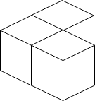
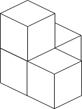
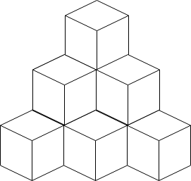
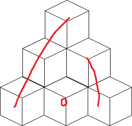

# 1739. Building Boxes

**Hard**
You have a cubic storeroom where the width, length, and height of the room are all equal to n units. You are asked to place n boxes in this room where each box is a cube of unit side length. There are however some rules to placing the boxes:

- You can place the boxes anywhere on the floor.
- If box x is placed on top of the box y, then each side of the four vertical sides of the box y must either be adjacent to another box or to a wall.
  Given an integer n, return the minimum possible number of boxes touching the floor.

n개의 박스를 n X n X n 공간에 넣는다.
특정 박스 x를 y위에 올려놓기 위해서는 y의 상하좌우로 같은 높이만큼 박스가 있어야한다. 혹은 벽으로 막혀있어야 한다.
바닥에 닿는 박스의 최소 개수 구하는 문제.

Example 1:


```
Input: n = 3
Output: 3
Explanation: The figure above is for the placement of the three boxes.
These boxes are placed in the corner of the room, where the corner is on the left side.
```

Example 2:


```
Input: n = 4
Output: 3
Explanation: The figure above is for the placement of the four boxes.
These boxes are placed in the corner of the room, where the corner is on the left side.
```

Example 3:


```
Input: n = 10
Output: 6
Explanation: The figure above is for the placement of the ten boxes.
These boxes are placed in the corner of the room, where the corner is on the back side.
```

Constraints:

- 1 <= n <= 109

# 풀이과정

기본적인으로 가장 적은 면이 바닥에 닿기 위해서는 가장 높게 쌓아야하고, 예제들을 봐도 알겠듯이, 구석에 몰아서 넣는 것이 벽을 최대한 활용해서 바닥에 깔아놔야하는 개수가 적어진다. 

박스 1개의 경우에는 1층에 박스가 1개 깔린다. 
박스 4개의 경우에는 1층에는 박스가 3개, 2층에는 1개가 깔린다. 
박스 10개의 경우에는 1층에는 박스가 6개, 2층에는 3개, 3층은 1개가 깔린다. 
최대의 박스 기준으로 k층의 박스를 쌓는다면 가장 바닥면의 박스 갯수는 시그마(n) = (n) X (n+1) / 2가 된다. 
또한 총 박스의 갯수는 시그마(시그마(n)) = (n) X (n+1) X (n+2) / 6가 된다. 

이를 이용해서 현재의 박스 수가 몇 층까지 쌓을 수 있나 먼저 찾는 단계가 있고, 이후 거기서 세부적으로 어떻게 박스를 더 배치해야하나에 대해서 찾으면 된다. 
몇 층을 쌓을 수 있는 지는 이분탐색을 사용하기도 했고, 완전탐색도 사용해봤는데, 이분탐색을 사용하면 숫자가 너무 커지면서 터졌다. 
(n) X (n+1) X (n+2) / 6이 곱하는 과정에서 터지게 되었는데, 완전탐색을 하면 이 공식을 사용하지 않고 계속 더해가므로 터지지 않은 것 같다. 

최대의 층을 구하고 난 뒤에는 이제 박스들을 하나씩 빼줘서 개수를 맞춰줘야한다.
바닥을 줄이는게 목적이므로, 바닥의 박스를 하나 빼게되면, 윗층의 조건이 안맞아지면서 연쇄적으로 한층씩 빠지게 된다. 
따라서 3층에서 바닥을 하나 없애면, 총 3개의 박스가 사라진다. 이후에 바닥을 하나 더 없애면 2개가 빠지고, 다음은 한개만 빼면 된다. 아래의 사진을 참고하면 도움이 될 것이다. 


```
while(maxBox-height >= n){
  bottomBox--;
  maxBox -= height;
  height--;
}
```