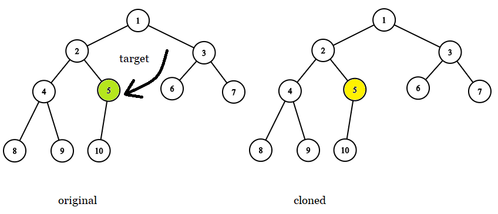

# 1379. Find a Corresponding Node of a Binary Tree in a Clone of That Tree

**Medium**
Given two binary trees original and cloned and given a reference to a node target in the original tree.

The cloned tree is a copy of the original tree.

Return a reference to the same node in the cloned tree.

Note that you are not allowed to change any of the two trees or the target node and the answer must be a reference to a node in the cloned tree.

Follow up: Solve the problem if repeated values on the tree are allowed.

트리와 그의 복사본 트리가 있는데, 여기서 트리에서의 Target노드를 Copy본에서의 위치를 반환해라.

Example 1:

```
Input: tree = [7,4,3,null,null,6,19], target = 3
Output: 3
Explanation: In all examples the original and cloned trees are shown. The target node is a green node from the original tree. The answer is the yellow node from the cloned tree.
```

Example 2:

```
Input: tree = [7], target =  7
Output: 7
```

Example 3:

```
Input: tree = [8,null,6,null,5,null,4,null,3,null,2,null,1], target = 4
Output: 4
```

Example 4:

```
Input: tree = [1,2,3,4,5,6,7,8,9,10], target = 5
Output: 5
```

Example 5:

```
Input: tree = [1,2,null,3], target = 2
Output: 2
```

Constraints:
- The number of nodes in the tree is in the range [1, 10^4].
- The values of the nodes of the tree are unique.
- target node is a node from the original tree and is not null.

# 풀이과정
처음에는 복사본도 직접만들어야하는줄 알고 복사하는 코드까지 짰는데 정답처리가 되지않아서 확인해보니, 복사본도 이미 만들어져있었다...
단순히 복사본과 원본을 같이 순회하면서 찾으면 current노드를 반환하면 된다. 매우 간단한 문제.